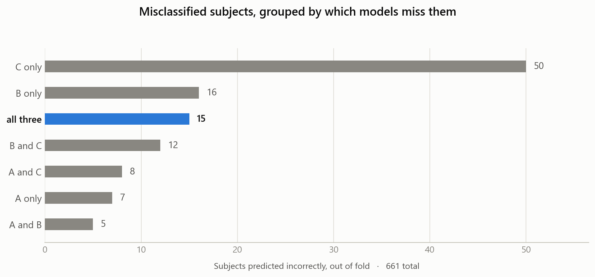

# Multivariate Time-Series Pain Classification

[](https://github.com/RenatoGallicola/timeseries-pain-classification/actions/workflows/ci.yml)
[](https://www.python.org/downloads/)
[](LICENSE)

Given 160 time steps of body-joint kinematics and survey readings for a subject,
predict their pain level: `no_pain`, `low_pain` or `high_pain`. 661 subjects to
learn from, 1324 to predict, and pre-trained models are forbidden — so the whole
problem is getting a network trained from scratch to generalise on very little
data.

Built for the first challenge of *Artificial Neural Networks and Deep Learning*
(AN2DL), Politecnico di Milano, A.Y. 2025/26.

| Task | Three-class classification of 160-step multivariate recordings |
|---|---|
| **Data** | 661 training subjects, 1324 test subjects, 160 time steps, 37 raw channels |
| **Class balance** | 511 / 94 / 56 (`no_pain` / `low_pain` / `high_pain`) |
| **Metric** | F1-score |
| **Final architecture** | CMA-ES-weighted ensemble of two CNN-GRU models and an InceptionTime model, refined by a binary low/high gate |
| **Out-of-fold weighted-F1** | **0.9526**, macro-F1 0.8957 |
| **Kaggle public leaderboard** | 0.9603 [^lb] |
| **Framework** | PyTorch |

[^lb]: Public leaderboard score, as recorded in the submitted report. Every other
figure on this page is recomputed from the artifacts in this repository.

**The final predictions are reproducible in seconds, without the dataset, a GPU
or PyTorch** — the per-subject logits of every model are committed:

```bash
python scripts/rebuild_submission.py   # rebuilds and verifies submission_final.csv
```

---

## The approach in one picture

```
raw signal (160 x 37)
      |
      +-- overlapping windows -----------> CNN-GRU  model A   (window 96,  stride 32)  --.
      |                                                                                  |
      +-- overlapping windows -----------> CNN-GRU  model B   (window 200, stride 50)  --+--> CMA-ES
      |                                                                                  |    weighted
      +-- + velocity / acceleration / -->  InceptionTime C    (window 128, stride 16)  --'    average
      |     rolling stats (92 feats)                                                          |
      |                                                                                       v
      +-- low/high specialist ----------->  CNN-GRU binary  --------------> confidence gate ---> prediction
```

Three ideas carry the solution:

1. **Windowing as augmentation.** 661 subjects is very little for a network trained
   from scratch. Cutting each recording into overlapping windows multiplies the
   effective sample size, and averaging the window logits back per subject at
   inference time (plus multi-stride test-time augmentation) removes a good deal of
   variance. Every split is grouped by subject, so no recording is ever spread
   across the train/validation boundary.

2. **Diversity over depth.** Rather than growing one model, we combined models that
   fail differently: A and B see the same architecture at different temporal
   scales, C sees a different *feature space* (explicit derivatives and rolling
   statistics) through multi-scale Inception convolutions. Ensemble weights are
   fitted with CMA-ES on out-of-fold logits.

3. **Spend capacity where the errors are.** The ensemble separates `no_pain`
   nearly perfectly; almost all remaining errors are `low_pain` vs `high_pain`,
   the two rarest classes. A dedicated binary classifier is consulted through a
   confidence gate, only for subjects the ensemble is unsure about.

Full write-up: [`report/`](report/AN2DL_2025_Challenge1_Report.pdf) (3 pages).
The architectures explored along the way: [`docs/EXPERIMENTS.md`](docs/EXPERIMENTS.md).

---

## Results

Out-of-fold, over all 661 training subjects. Regenerate with
`python scripts/ablation.py`; redraw with `python scripts/make_figures.py`.

<picture>
  <source media="(prefers-color-scheme: dark)" srcset="assets/ablation-dark.png">
  
</picture>

**Every component earns its place, and the InceptionTime branch earns the most**:
adding C to the A+B pair is worth +0.0048, the largest single step in the chart,
and the two-model ensemble already beats the best individual model. That is the
payoff of designing the three models to be different from each other rather than
deeper, and it shows up directly in which subjects each of them gets right:

<picture>
  <source media="(prefers-color-scheme: dark)" srcset="assets/error-diversity-dark.png">
  
</picture>

The groups are disjoint — each subject is counted once, under the exact set of
models that predicts it incorrectly. Of the 113 subjects that any model gets
wrong, **98 are recovered by the other two**; only 15 are hard for all three at
once. C's predictions are the most decorrelated from the rest (φ = 0.37 against
A, versus 0.45 between A and B), which is exactly what its different feature
space was designed to buy: 0.9531 accuracy out of three models that individually
sit between 0.88 and 0.95.

Per-class figures, the confusion matrix, the numbers printed during training and
how they relate to the report's table: [`docs/RESULTS.md`](docs/RESULTS.md).

---

## Reproducing the results

The models were trained on Google Colab GPUs; a full re-run is several hours.
The final inference stage, however, is fully reproducible on a laptop in seconds,
because the per-subject logits of every model are committed to `artifacts/`.

```bash
pip install -r requirements.txt

# Rebuild the submitted predictions from the committed logits and diff them
# against the file that was actually submitted.
python scripts/rebuild_submission.py

# Recompute the ablation table in docs/RESULTS.md.
python scripts/ablation.py
```

`rebuild_submission.py` exits 0 only if the rebuilt predictions match
`submissions/submission_final.csv` exactly. Neither script needs the dataset, a
GPU, or PyTorch.

The test suite pins the same guarantee, plus the behaviour of the windowing,
alignment and gate logic:

```bash
pip install -e ".[dev]"
pytest
```

CI runs the suite on Python 3.10 and 3.12 on every push, alongside both scripts
and a validity check over the notebooks.

To retrain from scratch you additionally need the competition CSVs
(see [`data/README.md`](data/README.md)) and a GPU runtime; open
[`notebooks/01_full_pipeline.ipynb`](notebooks/01_full_pipeline.ipynb) and run it
top to bottom.

---

## Repository layout

```
notebooks/
  01_full_pipeline.ipynb          the submitted solution, end to end, with outputs
  02_full_pipeline_raw_run.ipynb  the working Colab session that produced the artifacts
  experiments/                    eight curated exploratory notebooks (see docs/EXPERIMENTS.md)
src/
  config.py       all hyperparameters of the final run, in one place
  data.py         loading, outlier detection, temporal features, windowing, alignment
  models.py       CNN_GRU_Classifier, InceptionTime, CNN_GRU_Binary
  training.py     train/validate loops, early stopping, grouped K-fold OOF
  ensemble.py     CMA-ES weight search, temperature scaling, test-time augmentation
  gate.py         the confidence gate and its grid search
  submission.py   submission writing and validation
scripts/
  rebuild_submission.py   replay the final stage and verify against the submission
  ablation.py             recompute the results table from the committed logits
  make_figures.py         redraw the README figures
tests/            83 tests: windowing, alignment, gate branches, model shapes,
                  and an end-to-end check that the submission still reproduces
artifacts/        per-subject OOF and test logits for models A, B, C and the binary head
data/             sample_submission, feature list, detected outliers (dataset not included)
models/           how to regenerate the weights (the .pt files are not committed)
report/           the 3-page report submitted for grading
submissions/      the submitted predictions
docs/             RESULTS.md, EXPERIMENTS.md
assets/           README figures, light and dark
```

`src/` is a faithful extraction of the notebook code, so the models and the
pipeline can be read and diffed without opening a 400 kB notebook. The notebooks
remain the authoritative record of what was executed: they carry the training
logs of the submitted run.

**Reading order**, if you want the code rather than the results:
[`src/config.py`](src/config.py) for every hyperparameter that matters, then
[`src/models.py`](src/models.py) for the three architectures,
[`src/data.py`](src/data.py) for the windowing and subject-level alignment that
the whole pipeline rests on, and [`src/gate.py`](src/gate.py) for the fusion
step. [`notebooks/01_full_pipeline.ipynb`](notebooks/01_full_pipeline.ipynb)
runs through the same stages in order, with the outputs of the submitted run.

---

## License

Code released under the [MIT License](LICENSE). The Pirate Pain dataset belongs
to the AN2DL course and is not redistributed here.
