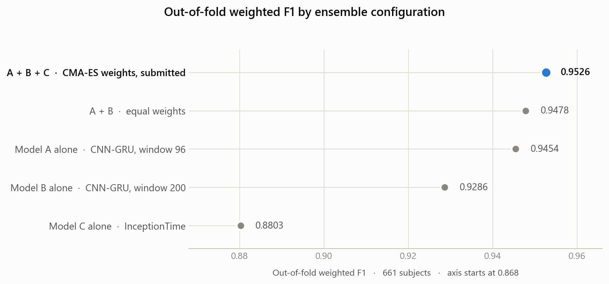
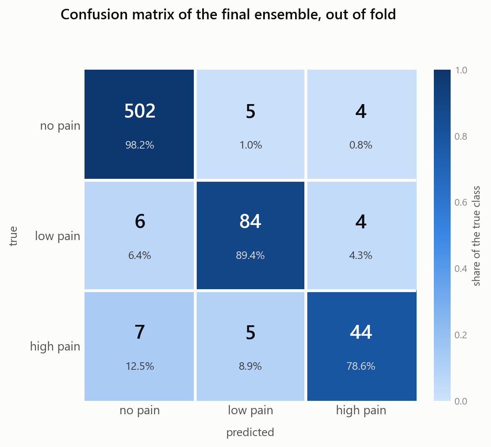

# Results

All figures on this page are **weighted F1** unless stated otherwise, matching what
the notebooks compute (`f1_score(..., average="weighted")`).

Two sources are used, and they are kept clearly apart:

* **Reproducible** — recomputed from the logits committed in `artifacts/` by
  `scripts/ablation.py`. Anyone cloning this repository gets the same numbers.
* **From the training run** — printed by the notebooks during the Colab session.
  These cannot be recomputed without retraining, so they are quoted with the
  notebook they come from.

---

## Ablation (reproducible)

Out-of-fold predictions over all 661 training subjects, from
`artifacts/oof_logits/`. Run `python scripts/ablation.py` to regenerate the
table and `python scripts/make_figures.py` to redraw the figures.

<picture>
  <source media="(prefers-color-scheme: dark)" srcset="../assets/ablation-dark.png">
  
</picture>

| Configuration | weighted-F1 | macro-F1 |
|---|---:|---:|
| Model A alone — CNN-GRU, window 96 / stride 32 | 0.9454 | 0.8828 |
| Model B alone — CNN-GRU, window 200 / stride 50 | 0.9286 | 0.8481 |
| Model C alone — InceptionTime, 92 features | 0.8803 | 0.7610 |
| A + B, equal weights | 0.9478 | 0.8897 |
| **A + B + C, submission weights** | **0.9526** | **0.8957** |
| A + B + C + binary gate | 0.9526 | 0.8957 |

Per-class breakdown of the final ensemble:

| Class | Precision | Recall | F1 | Support |
|---|---:|---:|---:|---:|
| `no_pain` | 0.9748 | 0.9824 | 0.9786 | 511 |
| `low_pain` | 0.8936 | 0.8936 | 0.8936 | 94 |
| `high_pain` | 0.8462 | 0.7857 | 0.8148 | 56 |
| **accuracy (= micro-F1)** | | | **0.9531** | 661 |

Confusion matrix (rows = true, columns = predicted):

```
              no_pain  low_pain  high_pain
  no_pain         502         5          4
  low_pain          6        84          4
  high_pain         7         5         44
```

<picture>
  <source media="(prefers-color-scheme: dark)" srcset="../assets/confusion-matrix-dark.png">
  
</picture>

### What the ablation says

* **Model B is the weakest single model but still earns its place.** Alone it
  scores 0.9286 against A's 0.9454, yet the equal-weight A+B pair beats A alone
  (0.9478). The two make different mistakes, which is the whole point.
* **Model C looks bad alone and helps anyway.** At 0.8803 it is far behind the
  GRU models, but adding it lifts the ensemble from 0.9478 to 0.9526 — the
  largest single gain in the table. It is trained on a different feature space,
  so it fails on different subjects: the correlation between its error vector
  and A's is φ = 0.37, against φ = 0.45 between A and B. Concretely, of the 34
  subjects the A+B ensemble gets wrong, C gets 11 right, and 5 subjects are
  recovered by C alone. Across all 661 subjects, 113 are missed by at least one
  model and only 15 by all three — the README figure breaks this down.
* **`high_pain` remains the bottleneck.** 0.8148 F1 on 56 subjects, with recall
  (0.7857) well below precision (0.8462): the model still under-calls the rarest
  class. Of the 12 misclassified `high_pain` subjects, 7 are called `no_pain`
  outright, which is the costliest error the model makes.
* **The gate does not move the needle at the operating point that was shipped.**
  With `alpha = 0.524` and `t_conf = 0.59` it fires on 1 subject out of 661
  out-of-fold, and on 1 test subject out of 1324. The threshold is high enough
  that the ensemble is almost never judged "uncertain", so the binary head is
  effectively never consulted. The mechanism is implemented and correct — see
  `src/gate.py` and `tune_gate()` — but this particular parameterisation leaves
  it dormant, and the gain the final submission shows over the A+B ensemble comes
  from model C, not from the gate.

---

## Numbers from the training run

The two notebooks in `notebooks/` are **two independent executions of the same
design**, so their fold-level numbers differ. Both are reported.

### Per-fold subject-level F1, models A and B

| Fold | `01_full_pipeline` A / B / mean | `02_full_pipeline_raw_run` A / B / mean |
|---|---|---|
| 1 | 0.9357 / 0.9236 / 0.9481 | 0.9305 / 0.9158 / 0.9367 |
| 2 | 0.9609 / 0.9613 / 0.9768 | 0.9602 / 0.9405 / 0.9768 |
| 3 | 0.9447 / 0.9455 / 0.9520 | 0.9447 / 0.9343 / 0.9533 |
| 4 | 0.9456 / 0.9231 / 0.9460 | 0.9537 / 0.9225 / 0.9529 |
| 5 | 0.9462 / 0.9419 / 0.9335 | 0.9201 / 0.9361 / 0.9361 |

Fold 2 is consistently the easiest and fold 1 the hardest in both runs — a
property of the subject split, not of the training.

### CMA-ES ensemble search

| Run | A + B | A + B + C |
|---|---:|---:|
| `01_full_pipeline` | 0.9526 | 0.9511 |
| `02_full_pipeline_raw_run` | 0.9540 | 0.9575 |

Two caveats on reading these:

1. **They are in-sample for the weights.** CMA-ES maximises F1 on the very
   out-of-fold logits it is scored on, so these values are optimistically biased.
   Evaluating the *fixed* shipped weights on the same logits gives 0.9526 (the
   ablation above), which is the fairer figure.
2. **The objective has wide plateaus.** F1 is a step function of the weights, so
   very different weight vectors score identically. In
   `02_full_pipeline_raw_run` two searches returned `(0.3670, 0.3804, 0.2527)`
   and `(0.3467, 0.3261, 0.3271)` with a weighted-F1 identical to all 16
   printed digits. The weights should be read as one point on a plateau, not as
   a uniquely optimal solution.

### Standalone model C, out-of-fold

| Run | window-level | subject-level | macro |
|---|---:|---:|---:|
| `01_full_pipeline` | 0.8543 | 0.8575 | 0.7413 |
| `02_full_pipeline_raw_run` | 0.9046 | 0.9045 | 0.7979 |

The gap between the two runs is large; model C is the least stable component of
the ensemble, which is consistent with its low standalone score.

### Single models, from the exploratory notebooks

| Experiment | Best validation weighted-F1 | Notebook |
|---|---:|---|
| CNN-GRU baseline | 0.9301 | `experiments/01_cnn_gru_baseline.ipynb` |
| CNN-GRU + Optuna | 0.9262 | `experiments/02_cnn_gru_optuna.ipynb` |
| Multi-branch CNN + squeeze-excitation | 0.9413 | `experiments/03_cnn_gru_multibranch_se.ipynb` |
| TCN hybrid | 0.9272 | `experiments/04_tcn_hybrid.ipynb` |
| Binary CNN1D (low/high subproblem) | 0.9586 | `experiments/06_binary_cnn1d_kfold.ipynb` |
| Binary feature analysis (low/high subproblem) | 0.9594 | `experiments/08_binary_feature_analysis.ipynb` |

The two binary scores are on the two-class `low_pain` vs `high_pain` problem and
are not comparable with the three-class figures above.

---

## Final submission

`submissions/submission_final.csv`, produced by the gate stage with
`wA = 0.4412`, `wB = 0.3246`, `wC = 0.2342`, `alpha = 0.524`, `t_conf = 0.59`:

| Class | Predicted subjects |
|---|---:|
| `no_pain` | 1028 |
| `low_pain` | 176 |
| `high_pain` | 120 |

`python scripts/rebuild_submission.py` regenerates this file from
`artifacts/test_logits/` and verifies it matches, prediction by prediction.

Note that these weights were selected during the Colab session and then fixed for
the final inference pass; the CMA-ES cells inside the notebooks re-run the search
and land elsewhere on the plateau described above. `src/config.py` records the
shipped values, which are the ones that produced the submitted file.

---

## Relationship to the report

`report/AN2DL_2025_Challenge1_Report.pdf` is the document submitted for
grading in November 2025 and is kept here unchanged. Its results table was
compiled during the final hours of the challenge and quotes the metric as
"F1-micro"; the notebooks and this page consistently use weighted F1, and the two
are not the same quantity (micro-F1 equals accuracy for single-label multiclass —
0.9531 here). Where the two disagree, the numbers on this page are the ones
backed by the committed artifacts and by `scripts/ablation.py`.
